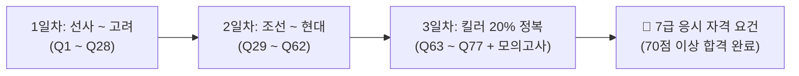

# 🇰🇷 한국사 국가 실전 시험 교구재 (한능검 심화 7급 합격 올인원 CBT)

> **"두꺼운 기본서 없이, 엑셀 족보 77개 공식과 실전 CBT 문제은행으로 단 3일 만에 7급 공무원 한능검 심화 합격선(70~85점)을 돌파하는 가장 확실한 교구재"**

---

## 📌 프로젝트 소개

본 교구재는 **국사편찬위원회(NIKH) 공식 기출 데이터(제60회~최신 70회대)**를 기반으로, 시험에 무조건 나오는 **77개 핵심 출제 족보**와 **실전 5지선다형 전자문제집(CBT) 플레이어**를 1:1로 결합한 국가시험 대비 올인원 학습 프로그램입니다.

- **기본기 80점 방어선**: 선사부터 현대사까지 매회 100% 동일하게 반복되는 필수 키워드 ➜ 정답 선지 매칭
- **킬러 20점 정복**: 수험생 오답률 1위인 [문화재 사진/탑/불상], [단골 지역사(강화도·개성·공주 등)], [고난도 순서 나열] 완벽 수록
- **100% 오프라인 지원**: 설치나 회원가입, 인터넷 연결 없이 파일만 열면 0초 만에 즉시 실행되는 초경량 시스템

---

## 📦 구성 요소

| 파일명 | 구분 | 설명 |
| :--- | :---: | :--- |
| **`cbt_player.html`** | **실전 CBT 프로그램** | 브라우저(크롬, 웨일, 엣지)로 바로 여는 77문항 반응형 CBT 문제은행 (사료 원문 지문, 4지선다, OMR 번호판, 1초 해설 팝업 내장) |
| **`한국사 능력 검정 심화 7급 공무원 준비.xlsx`** | **엑셀 마스터 족보** | 시대별 7개 시트 + 마스터 시트 + 킬러 Red 시트로 구성된 국사편찬위원회 공식 정답 공식집 (실전 CBT 바로풀기 연동) |
| **`한국사_실전_CBT_통합교구재_v1.0.zip`** | **배포용 통합 패키지** | 누구든지 다운로드하여 압축만 풀면 바로 사용할 수 있는 원클릭 패키지 |

---

## 🚀 빠른 시작 가이드 (초보자용 3초 사용법)

### 방법 1. 웹 브라우저로 바로 풀기 (가장 추천)
1. 저장소의 **`cbt_player.html`** 파일을 더블 클릭하여 엽니다. (크롬, 네이버 웨일, 엣지 권장)
2. 상단 헤더의 **`[📑 엑셀 표 함께보기 (새창 0%)]`** 버튼을 클릭합니다.
3. 상단에 펼쳐진 엑셀 요약 표를 보면서 원하는 문제를 클릭하면, **새 창이 뜨지 않고 그 자리에서 0.01초 만에 하단 문제가 실시간 전환**됩니다.
4. 문제를 풀고 즉시 **정답(초록색) / 오답(빨간색)** 및 **1초 해설과 암기 팁**을 확인합니다.

### 방법 2. 엑셀과 함께 공부하기
1. **`한국사 능력 검정 심화 7급 공무원 준비.xlsx`**를 엽니다.
2. 원하는 시대별 시트를 보며 사료 키워드와 정답 선지 공식을 눈으로 암기합니다.
3. I열의 **`[📝 실전 CBT 풀기]`** 링크를 클릭하여 실전 감각을 점검합니다.

---

## 🎯 7급 공무원 3일 단기 합격 커리큘럼

1. **1일차 (선사~고려, Q1~Q28)**:
   - 신석기(가락바퀴) / 청동기(고인돌) / 초기국가(부여·고구려·옥저·동예·삼한) 풍습 마스터
   - 삼국 전성기 왕(근초고왕, 광개토, 장수왕, 진흥왕) 및 통일신라 신문왕(관료전) 공식 암기
   - 고려 태조(훈요10조), 광종(노비안검법), 성종(시무28조), 공민왕(전민변정도감) 정복
2. **2일차 (조선~현대, Q29~Q62)**:
   - 조선 태종·세종·세조·성종 / 영조(균역법)·정조(신해통공) / 수취제도(대동법-공인)
   - 근대 개항기(강화도조약, 갑신정변, 동학, 갑오개혁, 광무개혁)
   - 일제강점기(1910 무단 / 1920 문화·신간회 / 1930~40 민족말살·한국광복군)
   - 현대사(모스크바 3상 회의 ➜ 5.10 총선 / 4.19 혁명 / 5.18 / 6월 민주항쟁)
3. **3일차 (킬러 20% 100점 완성, Q63~Q77)**:
   - 탑/불상 사진 문제: 익산 미륵사지 석탑 vs 석가탑 / 경천사지 10층탑 vs 원각사지 10층탑
   - 단골 지역사: 강화도 5대 공식 / 개성 / 공주 3종 세트 / 평양 / 대구·부산
   - 고난도 순서 나열: 신라 하대 / 4대 사화 / 숙종 환국 / 1920~30 만주 무장독립군

---

## 💻 CBT 플레이어 주요 기능

- **실제 국사편찬위원회 기출 원문 사료 수록**: 실제 시험지와 100% 동일한 줄글 사료 및 사료 독해 핵심 단서 제공
- **1문제 단독 집중 모드**: 실제 시험장 모니터 화면과 동일한 깔끔한 UI
- **우측 OMR 빠른 번호판 (`Q1` ~ `Q77`)**: 마우스 클릭 한 번으로 새 탭 없이 즉각 문제 점프
- **키보드 단축키 지원**:
  - `[←] / [→]` : 이전 문제 / 다음 문제 이동
  - `숫자 1, 2, 3, 4` : 보기 선택 및 즉시 채점
- **실시간 성적 분석**: 푼 문제 수, 정답률, 예상 점수 자동 집계

---

## 📥 릴리즈 다운로드

최신 완성본 배포 파일은 [Releases](../../releases) 페이지에서 **`한국사_실전_CBT_통합교구재_v1.0.zip`** 파일을 다운로드하실 수 있습니다.

---

## 📜 라이선스 (License)

This project is licensed under the MIT License - 누구나 자유롭게 다운로드하고 학습 및 공공 교육 목적으로 활용하실 수 있습니다.
